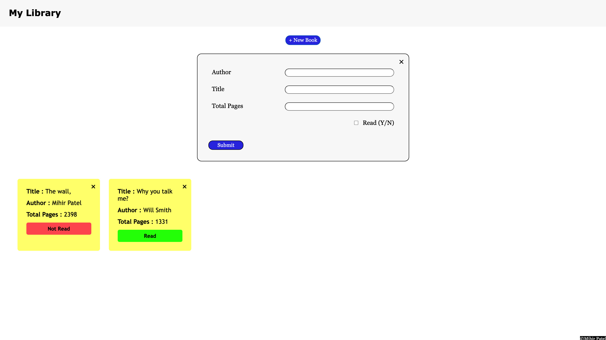

# My Library Project

## Description
This project is a simple book library application that allows users to add, remove, and toggle the read status of books. The books are displayed dynamically in the browser, and users can interact with them via buttons.

## Screenshot

## Features
- Add a new book with title, author, page count, and read status
- Remove a book from the library
- Toggle the read status of a book
- Interactive UI with dynamically updated book list

## Technologies Used
- HTML
- CSS
- JavaScript

## How to Use

1. Open `index.html` in a browser.
2. Click the `New Book` button to open the form.
3. Fill in the book details and submit the form.
4. The book will appear in the library display.
5. Click the `X` button to remove a book.
6. Click the `Read`/`Not Read` button to toggle the book's read status.

